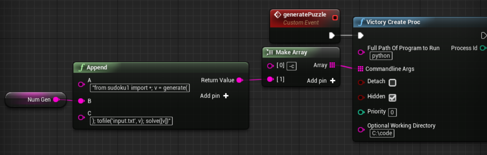

# UnrealSudokuSolver
Sudoku solver written in python that interfaces with Unreal Engine for the GUI.

In this team project, we created a python script to generate and solve sudoku puzzles. It does this by using contrained back-propogation algorithms. But we needed an interface. I used Unreal Engine and created a sudoku puzzle class and made a simple script that solved the puzzle with brute force (significantly slower that the Python script, for effect). Instead of translating the Python code to C++, I used Rama's plugin that allows for OS process creation and created an interface between Unreal Engine and Python. This is the call to Python that is run in a new process:
```
"from sudoku1 import *; v = generate( [variable_from_unreal_engine] ); tofile('input.txt', v); solve([v])"
```
The semicolons actually execute the command up until that point (which I certainly didn't know about the command line and Python).

While this is really cool in my opinion, the applications are probably limited. It's slow and relies on the transfer of strings between Unreal Engine and Python. However it handles this small proof of concept example very well.


#### The part of the Unreal Engine script that interfaces with the Python script:
<p align="left">
  
</p>

#### The brute force method solving the puzzle:
<video width="640" height="480" controls>
  <source src="sudoku-brute.mp4" type="video/mp4">
  <a href="https://ryanawalters.github.io/UnrealSudokuSolver/"><b>Please view this page with videos enabled!</b></a>
</video>

#### The back propogation method solving the puzzle using the Python script:
<video width="640" height="480" controls>
  <source src="sudoku-good.mp4" type="video/mp4">
  <a href="https://ryanawalters.github.io/UnrealSudokuSolver/"><b>Please view this page with videos enabled!</b></a>
</video>
